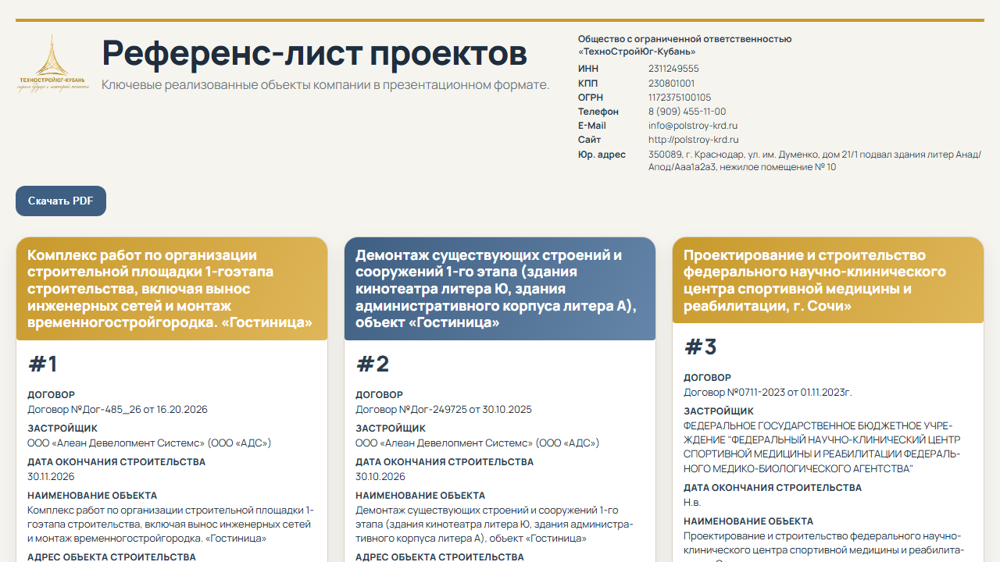

# Reference List PDF (A4 Landscape)

Веб-приложение для подготовки референс-листа строительных проектов и экспорта в многостраничный PDF формата A4 (landscape) с аккуратной типографикой, равномерной шапкой и сеткой карточек.



## Что умеет

- Редактирование карточек проектов прямо в интерфейсе
- Автосохранение правок в `localStorage`
- Генерация PDF в A4 landscape по страницам
- Повторяемая шапка на каждом листе
- Юридические реквизиты в 2 колонки в шапке
- Сетка 4 карточки на лист
- Подстройка карточек для предотвращения наложения текста

## Структура проекта

- `version2.html` — основной шаблон страницы
- `styles-v2.css` — экранные и печатные стили
- `app-v2.js` — рендер карточек, редактирование, экспорт PDF
- `data/reference-data.json` — исходные данные объектов
- `docs/visual-reference.png` — визуальный референс текущего UI

## Быстрый старт

### 1) Установка

```bash
npm install
```

### 2) Локальный запуск

Любой статический сервер, например:

```bash
python -m http.server 4173
```

Откройте:

- `http://127.0.0.1:4173/version2.html`

### 3) Экспорт PDF

1. Отредактируйте нужные поля на странице
2. Нажмите **"Скачать PDF"**
3. Будет скачан файл `reference-list-v2.pdf`

## Технические детали

- Рендер PDF выполняется через `html2canvas` + `jsPDF`
- Каждая PDF-страница рендерится отдельно, затем добавляется в общий документ
- Для предотвращения артефактов:
  - дождидание `document.fonts.ready`
  - предобработка карточек (`fitCardForPdf`) перед рендером

## Деплой

Проект подходит для статического хостинга:

- GitHub Pages
- Vercel (static)
- Netlify

Продакшен-ссылка (GitHub Pages):

- https://soccershortsunleashed-ops.github.io/ref-list-pdf-a4/version2.html

## Лицензия

MIT
